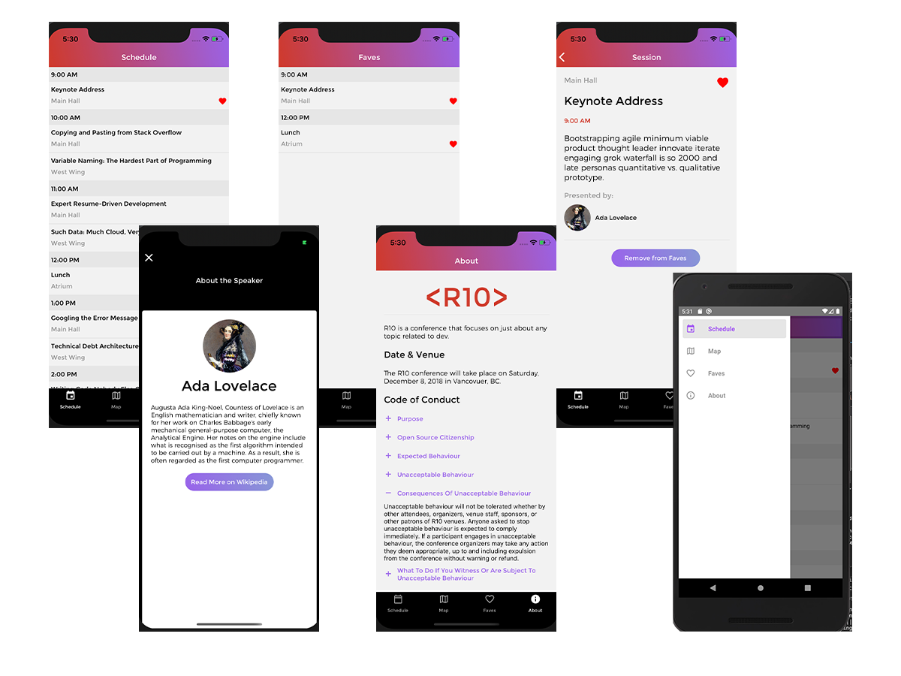

# R10 👨‍🏫

R10 is a native application for both IOS and Android. It is a speaker session scheduling app where the user can favourite different sessions, and find the sessions with the Google Maps API. It uses [React-Natives](https://reactnative.dev/) built in components and the [React Navigation](https://reactnavigation.org/) library for stack navigation throughout the app. I also utilized [Apollo Client](https://www.apollographql.com/docs/react/) to obtain data from RED Academy's GraphQL endpoints. Icons throughout the app were obtained a combination of [React Native Vector Icons](https://github.com/oblador/react-native-vector-icons) library and from the [Material UI Community Icons](https://materialdesignicons.com/) library.



## Installation Instructions

Follow the instructions below to run the application in on your local device.

### Installation

```
yarn install
cd ios
pod install
```

### Run IOS

```
react-native run-ios
```

### Run Android

```
react-native run-android
```

## Technologies Used

### GraphQL / Apollo Client

- A more direct query language to access data in an API
- Integrated queries with Apollo Client and RED Academy's endpoints

### React-Native

- A component based JavaScript library that uses state management to create complex User Interfaces for both IOS and Android OS.
- Uses super simple, built in components like `View Text Image SafeAreaView` for quick and easy app builds

### React Navigation

- A library to quickly integrate a history stack into a React-Native app
- Has simple functions, thoroughly described in their docs, like `createStackNavigator` and `createDrawerNavigator`
- Uses super simple, built in components like `View Text Image SafeAreaView` for quick and easy app builds

### React Native Maps

- A react native community library to implement Google maps SDK for IOS and Android

## Personal Learnings

Building my first native was actually easier than I thought it would be. React Native is very simple to implement, and very quick as well. The hybrid capabilities of React Native made building OS specific apps extremely quick, all that was required was configuring the Platform component.

React Navigation also has quick and easy implementation. History stacks have never been so easy to build!

Overall, this app was a great introduction into native apps and I look forward to building more!
